<!--- New polished README for repository -->

<p align="center">
   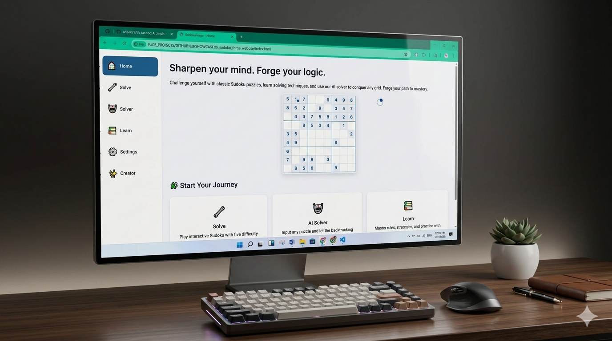
  
   <h1 align="center">SudokuForge</h1>
   <p align="center"><strong>Forge your logic. Solve the grid.</strong></p>
   <p align="center">
      
      
      
      
      <a href="#live-demo"></a>
   </p>
</p>

---

## Short Description

Minimal, offline-first Sudoku web app built with plain HTML, CSS and JavaScript. Includes a generator, an AI backtracking solver, a hint system, an interactive learn page, and responsive UI designed for portfolio showcase.

---

## Badges

- **Languages:** HTML · CSS · JavaScript
- **License:** MIT
- **Status:** Prototype / Portfolio

> Badges above are generated from detected project technologies (HTML, CSS, JavaScript).

---

## Features

- Clean, framework-free codebase — ideal for learning and customization
- Puzzle generator with five difficulty levels
- Fast AI solver (backtracking) and cross-page puzzle transfer
- Logical hint engine and mistake detection
- Responsive design, custom cursor, animated loader and home page visuals
- Lightweight, fully client-side — runs without a server

---

## Screenshots

Below are in-repo screenshots captured from the app. Click to view full resolution.

<details>
<summary>View screenshots</summary>

<table>
   <tr>
      <td align="center">
         
         <p><em>Home — Animated puzzle cycle</em></p>
      </td>
      <td align="center">
         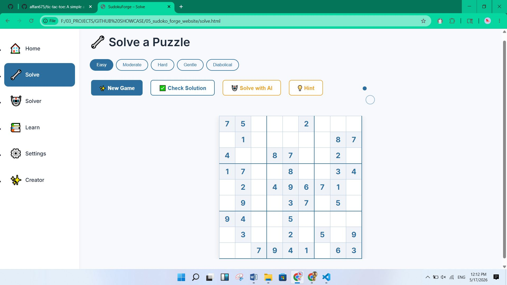
         <p><em>Play — Interactive solver UI</em></p>
      </td>
      <td align="center">
         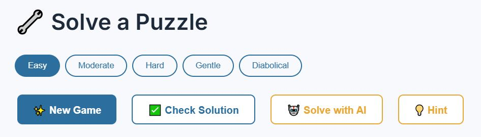
         <p><em>Difficulty & options</em></p>
      </td>
   </tr>
   <tr>
      <td align="center">
         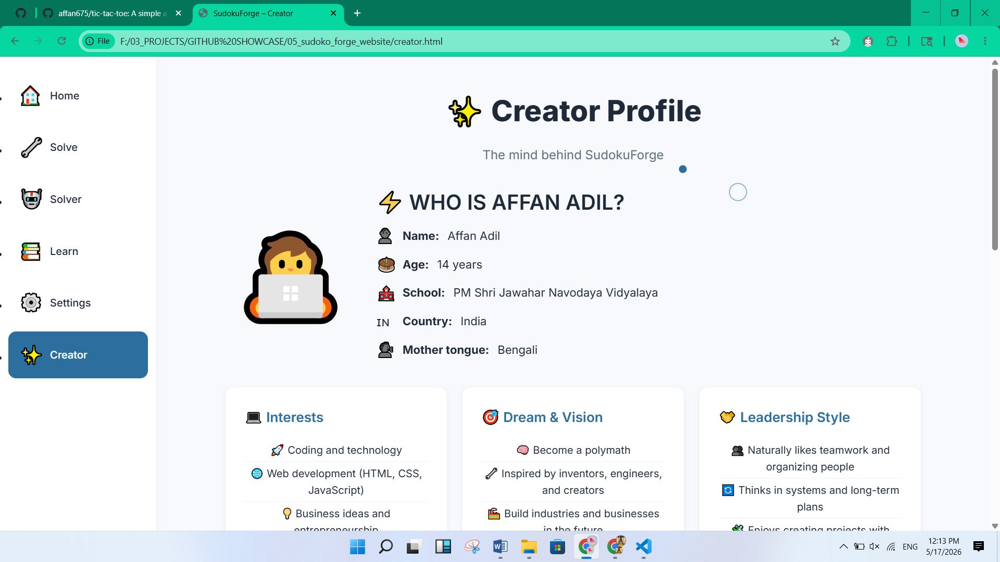
         <p><em>Creator — About page</em></p>
      </td>
      <td align="center">
         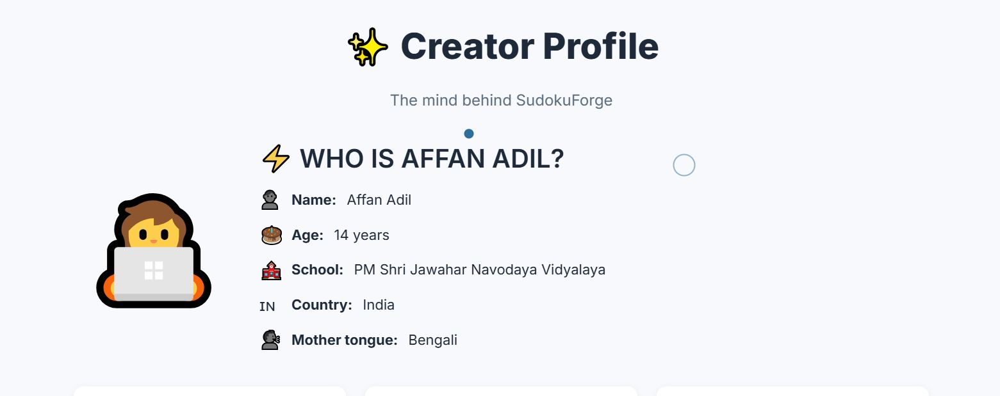
         <p><em>Creator details & profile</em></p>
      </td>
      <td align="center">
         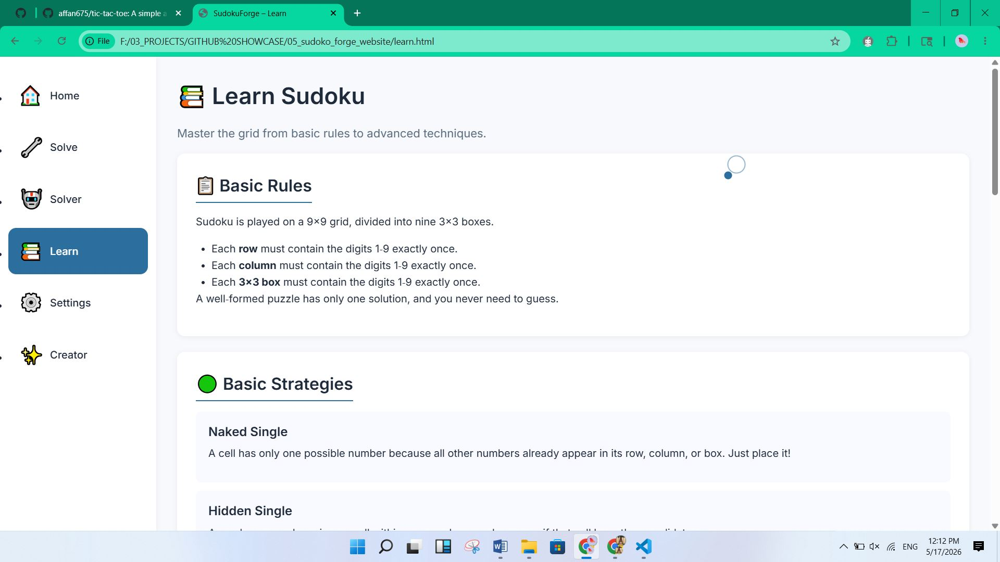
         <p><em>Learn — Mini tutorials & 4×4 practice</em></p>
      </td>
   </tr>
   <tr>
      <td align="center">
         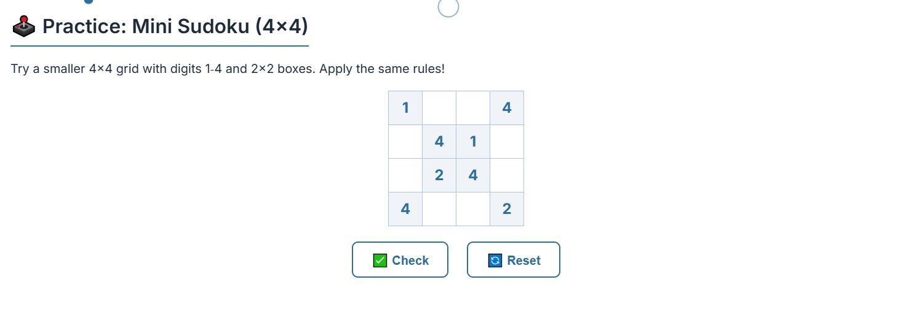
         <p><em>Practice grid</em></p>
      </td>
      <td align="center">
         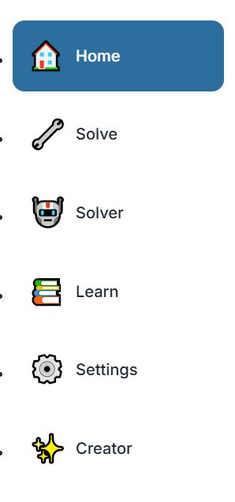
         <p><em>Sidebar navigation</em></p>
      </td>
      <td align="center">
         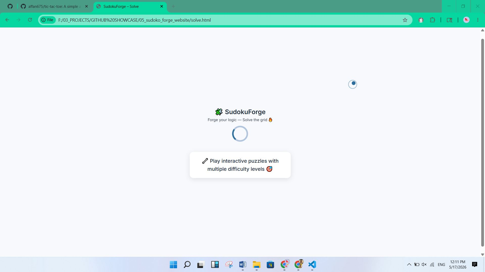
         <p><em>Loader with rotating tips</em></p>
      </td>
   </tr>
   <tr>
      <td align="center">
         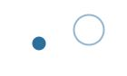
         <p><em>Custom cursor (desktop)</em></p>
      </td>
      <td align="center">
         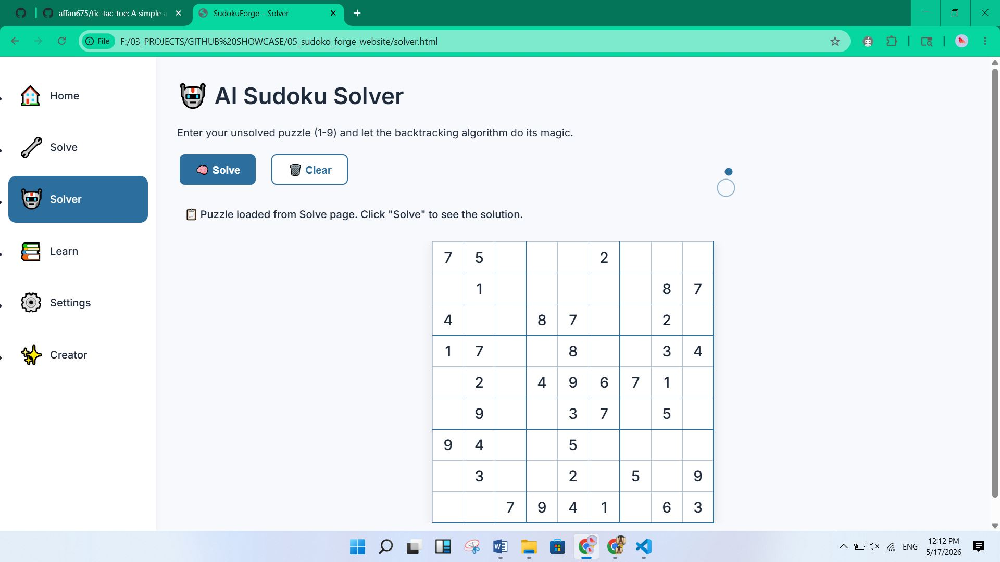
         <p><em>AI Solver — backtracking results</em></p>
      </td>
      <td></td>
   </tr>
</table>

</details>

---

## Live Demo

- Placeholder: open `index.html` locally or use GitHub Pages / Live Server to preview.

---

## Tech Stack

- HTML5 — semantic markup and accessibility-focused structure
- CSS3 — variables, Grid/Flexbox, animations
- JavaScript (ES6) — puzzle generator, solver, UI logic

---

## Installation / Setup

1. Clone the repository:

```bash
git clone <your-repo-url>
cd sudokuforge
```

2. Open locally: double-click `index.html`, or start a simple server:

```bash
# Install serve (optional)
npm install -g serve
serve .
```

3. For development, use VS Code Live Server for CORS-friendly component fetches.

---

## Usage

- Play: open `solve.html`, choose difficulty, click **New Game**
- Hint: click **Hint** to reveal a logical move
- Solve: click **Solve with AI** to view the complete solution or visit `solver.html`

---

## Folder Structure

```text
./
├─ index.html
├─ solve.html
├─ solver.html
├─ learn.html
├─ creator.html
├─ css/ (variables, styles, responsive, loader, cursor)
├─ js/  (main, solve, ai-solver, hint, loader)
├─ components/ (sidebar)
└─ assets/screenshots/ (project screenshots)
```

---

## Contribution

- Contributions are welcome — file issues or open a pull request with a clear description. Keep changes focused and add tests or screenshots for UI updates.

Suggested contributions:
- Improve generator randomness and difficulty tuning
- Add advanced logical hint techniques (hidden pairs, X-Wing)
- Add automated test suite and CI

---

## Future Improvements

- Publish on GitHub Pages with a live demo URL
- Add progressive web app (PWA) support and offline caching
- Advanced hint strategies and step-by-step solution explanations
- Accessibility audit and keyboard-first navigation improvements

---

## License

This project is released under the MIT License.

---

## Author

Affan Adil — Student & developer

Portfolio: (add link) · Contact: (add email)

---

Made with ❤️ — designed to teach and showcase clean front-end engineering.